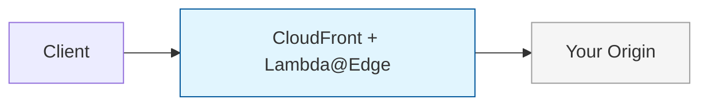
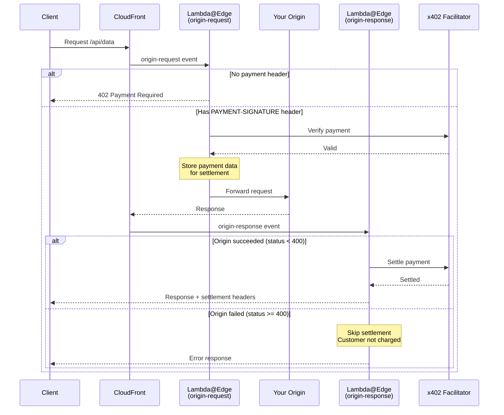

# x402 CloudFront + Lambda@Edge

Add x402 payments to any web server without modifying your backend.




## Why This Approach?

- **Zero backend changes** — your origin server stays untouched
- **Works with any origin** — APIs, static sites, cached or non-cached content
- **Any cloud or on-prem** — AWS, GCP, Azure, third-party services, or your own infrastructure
- **Drop-in monetization** — add payments to existing endpoints in minutes
- **Multi-chain** — accept payments on Base and Solana from the same routes
- **Edge performance** — payment verification at CloudFront's global edge locations
- **Fair billing** — customers only charged when the request succeeds

## Getting Started

### New to AWS? Choose your path

| Guide | Best for | What you'll use |
|---|---|---|
| [Console Guide](./GETTING-STARTED-CONSOLE.md) | Learning the architecture, first-time AWS setup | AWS Console (browser only, no CLI) |
| [CDK Guide](./GETTING-STARTED-CDK.md) | Repeatable deployments, taking this to production | AWS CLI + `cdk deploy` |

Both guides deploy the same architecture. Start with the Console guide if you want to understand what each AWS resource does. Use the CDK guide if you want a single command to deploy and destroy everything.

### Already using CloudFront + Lambda@Edge?

The example files are ready for you to add your business logic:

| File                                                               | Purpose                                          |
| ------------------------------------------------------------------ | ------------------------------------------------ |
| [`lambda/src/config.ts`](./lambda/src/config.ts)                   | Configure routes, pricing, and payment addresses |
| [`lambda/src/origin-request.ts`](./lambda/src/origin-request.ts)   | Customize the origin-request handler             |
| [`lambda/src/origin-response.ts`](./lambda/src/origin-response.ts) | Customize the origin-response handler            |
| [`lambda/src/index.ts`](./lambda/src/index.ts)                     | Main exports for both handlers                   |

Copy these into your project and integrate with your existing setup.

### New to CloudFront or Lambda@Edge?

This example is a great starting point. Here are the essentials:

**CloudFront basics:**
- [What is Amazon CloudFront?](https://docs.aws.amazon.com/AmazonCloudFront/latest/DeveloperGuide/Introduction.html)
- [Getting started with CloudFront](https://docs.aws.amazon.com/AmazonCloudFront/latest/DeveloperGuide/GettingStarted.html)

**Lambda@Edge basics:**
- [What is Lambda@Edge?](https://docs.aws.amazon.com/AmazonCloudFront/latest/DeveloperGuide/lambda-at-the-edge.html)
- [Tutorial: Creating a Lambda@Edge function](https://docs.aws.amazon.com/AmazonCloudFront/latest/DeveloperGuide/lambda-edge-how-it-works-tutorial.html)

<details>
<summary>Lambda@Edge constraints to keep in mind</summary>

| Constraint            | Details                                    |
| --------------------- | ------------------------------------------ |
| Region                | Must deploy to `us-east-1`                 |
| Environment variables | Not supported — config is bundled in code  |
| Timeout               | Max 30 seconds for origin-request/response |
| Response size         | Max 1MB for generated responses            |

See [Lambda@Edge quotas](https://docs.aws.amazon.com/AmazonCloudFront/latest/DeveloperGuide/edge-functions-restrictions.html) for the full list.

</details>

---

## Quick Start

### 1. Copy the Lambda Source

Copy `lambda/src/` into your project and adapt the build to your tooling.


### 2. Configure Payment Settings

Edit `config.ts`:

```typescript
export const FACILITATOR_URL = 'https://x402.org/facilitator';
export const EVM_NETWORK = 'eip155:84532'; // Base Sepolia testnet
export const EVM_PAY_TO = '0xYourEvmPaymentAddressHere';
export const SVM_NETWORK = 'solana:EtWTRABZaYq6iMfeYKouRu166VU2xqa1'; // Solana Devnet
export const SVM_PAY_TO = 'YourSolanaPaymentAddressHere';
```

The default facilitator supports both testnets, so no facilitator change is needed for testing. Get test USDC for either network from the [Circle faucet](https://faucet.circle.com).

> The Solana `payTo` address must already have a USDC token account (an address gets one the first time it ever receives that token); send it any amount of USDC once before going live.

### 3. Configure Routes

Define which routes require payment:

```typescript
export const ROUTES: RoutesConfig = {
  '/api/*': {
    accepts: [
      {
        scheme: 'exact',
        network: EVM_NETWORK,
        payTo: EVM_PAY_TO,
        price: '$0.001',
      },
      {
        scheme: 'exact',
        network: SVM_NETWORK,
        payTo: SVM_PAY_TO,
        price: '$0.001',
      },
    ],
    description: 'API access',
  },
};
```

### 4. Deploy

Bundle and deploy both Lambda functions:

| Lambda Function         | CloudFront Event | Purpose                            |
| ----------------------- | ---------------- | ---------------------------------- |
| `originRequestHandler`  | origin-request   | Verify payment, forward to origin  |
| `originResponseHandler` | origin-response  | Settle payment if origin succeeded |

```typescript
import { originRequestHandler, originResponseHandler } from './index';
```

---

## Networks

| Network        | ID                                        | Use        |
| -------------- | ----------------------------------------- | ---------- |
| Base Sepolia   | `eip155:84532`                            | Testing    |
| Base Mainnet   | `eip155:8453`                             | Production |
| Solana Devnet  | `solana:EtWTRABZaYq6iMfeYKouRu166VU2xqa1` | Testing    |
| Solana Mainnet | `solana:5eykt4UsFv8P8NJdTREpY1vzqKqZKvdp` | Production |

---

## Running on Mainnet

To accept real payments, you need a mainnet facilitator that supports your networks. Each facilitator may have different authentication requirements. Browse available facilitators at the [x402 Ecosystem — Facilitators](https://www.x402.org/ecosystem?filter=facilitators).

Update `config.ts` with your chosen facilitator, both mainnet networks, and your wallet addresses:

```typescript
export const FACILITATOR_URL = 'https://your-facilitator-url';
export const EVM_NETWORK = 'eip155:8453'; // Base mainnet
export const EVM_PAY_TO = '0xYourEvmMainnetWalletAddress';
export const SVM_NETWORK = 'solana:5eykt4UsFv8P8NJdTREpY1vzqKqZKvdp'; // Solana mainnet
export const SVM_PAY_TO = 'YourSolanaMainnetWalletAddress';
```

If your facilitator requires authentication, you can pass a `facilitatorConfig` object (with `url` and `createAuthHeaders`) via the middleware config. Update `config.ts`:

```typescript
// Example: using a facilitator package that provides a config with auth
import { createFacilitatorConfig } from 'your-facilitator-package';

export const FACILITATOR_CONFIG = createFacilitatorConfig('api-key-id', 'api-key-secret');
```

Then pass it in `origin-request.ts` and `origin-response.ts`:

```typescript
const x402 = createX402Middleware({
  facilitatorUrl: FACILITATOR_URL,
  routes: ROUTES,
  facilitatorConfig: FACILITATOR_CONFIG, // overrides facilitatorUrl when provided
});
```

> **Note**: Lambda@Edge does not support environment variables. If your facilitator reads credentials from `process.env`, you can pass them explicitly via the config function, or fetch them from AWS Secrets Manager at runtime.

---

## File Structure

```
cloudfront-lambda-edge/
├── lambda/src/
│   ├── index.ts           # Main exports
│   ├── origin-request.ts  # Handler for origin-request event
│   ├── origin-response.ts # Handler for origin-response event
│   ├── config.ts          # Routes, addresses, network config
│   └── lib/               # Reusable x402 middleware
│       ├── index.ts       # Package exports
│       ├── middleware.ts   # createX402Middleware factory
│       ├── server.ts      # createX402Server factory
│       ├── adapter.ts     # CloudFrontHTTPAdapter
│       └── responses.ts   # Lambda@Edge response helpers
```

---

## Middleware Pattern

The `lib/` folder follows the same pattern as `@x402/express`, `@x402/hono`, etc.:

```typescript
import { createX402Middleware, MiddlewareResultType } from './lib';

// Create middleware with config
const x402 = createX402Middleware({
  facilitatorUrl: 'https://x402.org/facilitator',
  routes: {
    '/api/*': {
      accepts: [
        { scheme: 'exact', network: 'eip155:84532', payTo: '0x...', price: '$0.01' },
        {
          scheme: 'exact',
          network: 'solana:EtWTRABZaYq6iMfeYKouRu166VU2xqa1',
          payTo: '...',
          price: '$0.01',
        },
      ],
      description: 'API access',
    },
  },
});

// Use in handlers
export const handler = async (event: CloudFrontRequestEvent) => {
  const request = event.Records[0].cf.request;
  const distributionDomain = event.Records[0].cf.config.distributionDomainName;
  
  // Your custom logic first (auth, WAF, logging, etc.)
  
  const result = await x402.processOriginRequest(request, distributionDomain);
  
  if (result.type === MiddlewareResultType.RESPOND) {
    return result.response; // 402 Payment Required
  }
  
  return result.request;
};
```

---

## Advanced Patterns

<details>
<summary>WAF Integration for Bot Protection</summary>

Use AWS WAF to label bots, then require payment only for labeled requests:

```typescript
const isBot = request.headers['x-amzn-waf-bot']?.[0]?.value;
if (isBot) {
  // Add bot-specific routes or pricing
}
```

This lets you monetize bot/scraper traffic while keeping human users free.

</details>

<details>
<summary>Caching Optimization</summary>

CloudFront caching can reduce facilitator calls:

- **Unpaid requests**: Cache 402 responses so repeated requests without payment don't hit Lambda@Edge
- **Token-based payments**: Cache responses by payment token

Configure cache behaviors to include `PAYMENT-SIGNATURE` header in the cache key.

</details>

<details>
<summary>Cookie-Based Sessions</summary>

For browser apps, extend `CloudFrontHTTPAdapter` to read from cookies:

```typescript
getHeader(name: string): string | undefined {
  if (name.toLowerCase() === 'payment-signature') {
    const cookie = this.request.headers.cookie?.[0]?.value;
    const match = cookie?.match(/x402-payment=([^;]+)/);
    if (match) return decodeURIComponent(match[1]);
  }
  return this.request.headers[name.toLowerCase()]?.[0]?.value;
}
```

</details>

<details>
<summary>Payment Flow Internals</summary>

**Why two Lambda functions?**

The x402 pattern is: verify → execute → settle. By splitting into two functions:
- **origin-request**: Verifies payment, stores data in `x-x402-pending-settlement` header
- **origin-response**: Settles only if status < 400

This ensures customers only pay for successful requests.



**Security**: Any client-injected `x-x402-pending-settlement` header is automatically removed to prevent payment bypass attacks.

</details>
